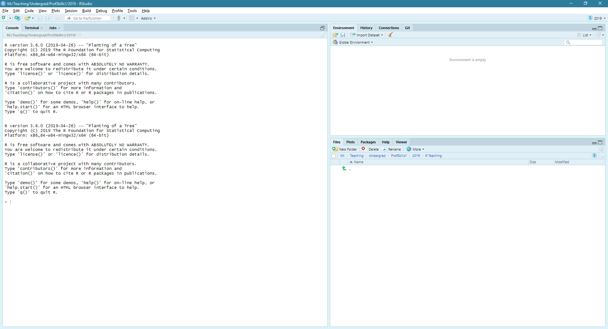
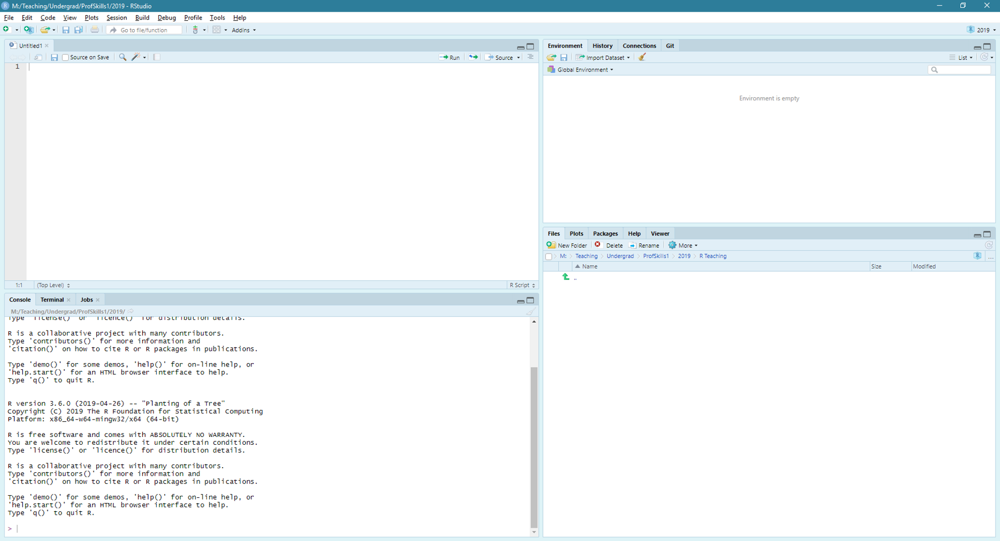
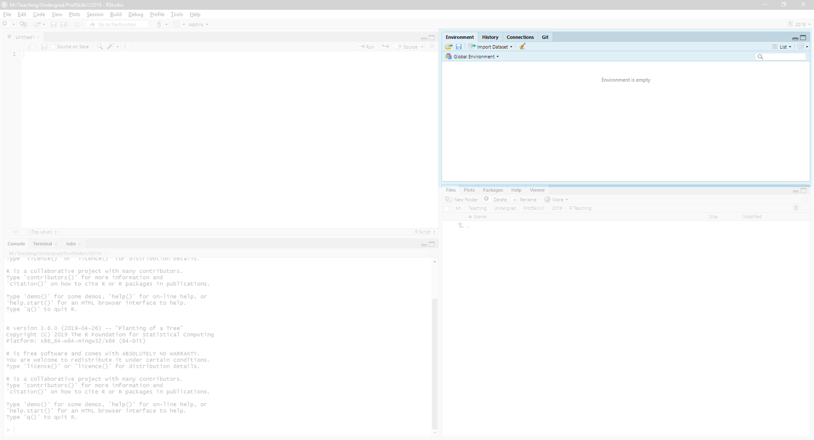
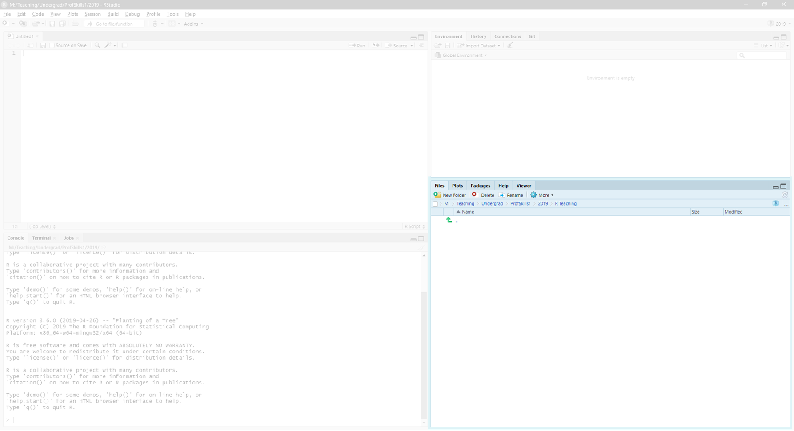
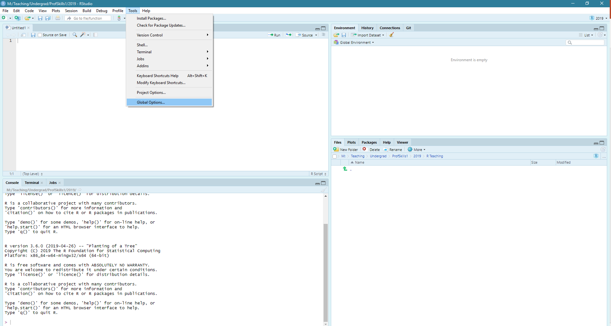
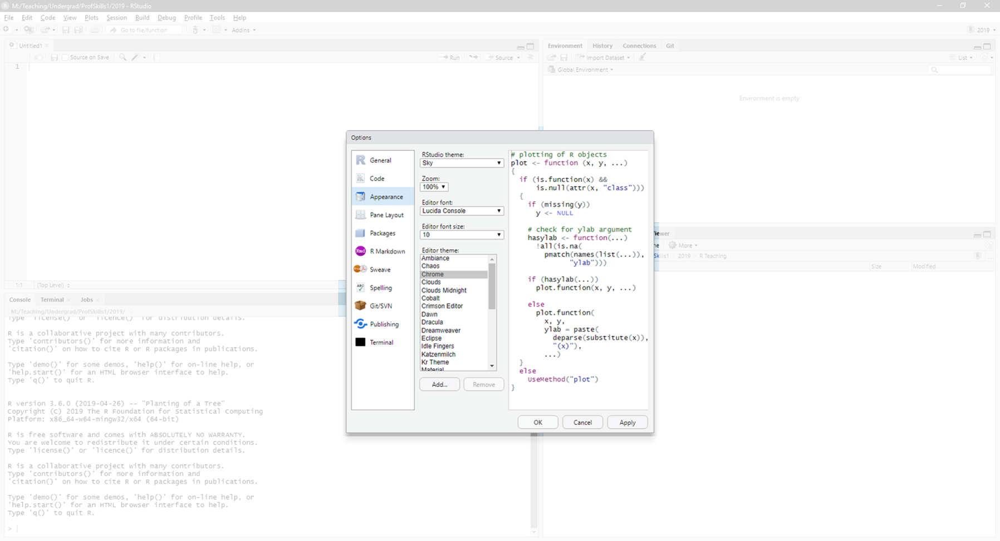

# Installing R {#install}

```{block, type = "los"}
You can skip this chapter if you already have access to R and R Studio, and feel confident navigating between the console and environment panes.

```


To use R on your own PC or laptop, you will need to install two things:

1. R (the programming language)
2. R Studio (a software that makes R easier to run)

You can also access R Studio [online](#install_rsc) which can be great if you have a good internet connection, or are on a computer that you don't have admin rights to. 

R Studio is an *integrated development environment* which makes it easier to use R. It is made by a company called [Posit](https://posit.co/) who create a lot of statistical coding related projects and have a really [cool and supportive community](https://community.rstudio.com/).

**Important:** If you want to use R and R Studio on your own device you need to install both.

If you prefer **watching instructions** you can watch [the installation videos](#install_vids) below.


## Install R {#install_r}
R is the programming language we will use. It is freely available, meaning you **do not need to pay for R**.

To install R, you will need to navigate to (or click the link to) the Comprehensive R Archive Network - [cran](https://cran.r-project.org/).

While there, you want to download R for your operating system (most likely Windows or Mac). Click the link that names your operating system and look for the instructions that say **install R for the first time**.

There will be a link that says something like **Download R 4.3.1 for Windows**. (The exact version number is not really important yet).

After you have installed R, you can check to see if it works, or go straight to installing [R Studio](#install_rs)


## Install R Studio {#install_rs}
R Studio is a tool that helps make R more user friendly. It also lets you collect all your data files into 'projects'. This is very useful for managing your projects and 'workflows' (more on [that here](#workflows)).

To download R Studio follow [this link](https://posit.co/download/rstudio-desktop/).

You want the **R Studio Desktop Free** version. You will not need to pay for anything to use R as part of your studies at R(D)SVS. When you click the download link above, you will find a button at the bottom of the page to download R Studio Desktop. After you click that button you will be able to choose the version that works for you. Follow the instructions on the page for your operating system. 

### Note for those using a managed PC
If you are using a university managed PC then the [Software Centre](https://www.ed.ac.uk/information-services/computing/desktop-personal/supported/windows-10/training/software-center) will take care of this for you. All open access university PCs should have a version of R Studio already installed. 

### Quick R Studio Navigation Guide {#navigate_rs}
If you have never coded before, R Studio might look very intimidating. In this short section we will walk through the different parts of R Studio. If you find yourself getting lost later in the book, come back here to get a refresher.

In **Figure 1.1** you will see a view of R Studio as you first open it. There may be some differences, e.g. you will likely have a different R Version number. 


```{r echo = FALSE, fig.width = 4, fig.cap="R Studio Overview", fig.align = 'center' }



```

#### Click on File > New File> R Script

Now your screen should look like **Figure 1.2**. You will have four panes in your window, and each pane can be dragged around or minimised. Note - you want to create a new R Script file, **not** an R Markdown or R Notebook file. We will do that next. 

```{r echo = FALSE, fig.width = 4, fig.cap="R Studio Overview with Script File", fig.align = 'center'}



```

#### The file pane

On the top left hand side of the R Studio window you can view the untitled R Script file you have just opened (**Figure 1.3**). Here you will see views of your files (mostly R Script files and R Markdown files in this book), and views of your data.

```{r echo = FALSE, fig.width = 4, fig.cap="The active file pane", fig.align = 'center'}

knitr::include_graphics("images/02_install/rstud03.png")

```


#### The console

If you were using plain R (without R Studio) this console window is all you would see. Where you see this **>** symbol in the console you can type in a simple maths equation.

I recommend you type something now, perhaps `2 + 2`

When you have finished typing, hit enter on your keyboard and see what the answer is. 

Type `2 + ` and then hit enter. What happens? You will need to hit 'escape' ('esc') on your keyboard to make the **>** symbol appear again. 

Hitting 'enter' asks R to perform the last command. Because we didn't tell R what it had to add, it kept waiting to find out what would come next.


```{r echo = FALSE, fig.width = 4, fig.cap="The console pane", fig.align = 'center'}

knitr::include_graphics("images/02_install/rstud04.png")

```


#### The Environment pane

The Environment is shown in **Figure 1.5**. At the moment, your environment will be empty. We will talk more about what goes here in [the environment section of getting started](#environment).


```{r echo = FALSE, fig.width = 4, fig.cap="The environment pane", fig.align = 'center'}



```

#### Files, plots, packages, help and viewer

The final pane, shown in **Figure 1.6**, has five tabs in it by default. 

These are:

* Files
  + Think of this like a Windows Explorer window (folder window) on your PC. It will show you all the files in your current folder and may just show your .Rproj file right now.

* Plots
  + When we start drawing charts they'll be saved here. 
 
* Packages
  + Other wonderful people in the R Community write lots of clever code that can be 'packaged' up so we can use it. Instead of writing out all the code you need to make a chart, you can use someone's package instead. We will learn more about these in [packages](#packages)
 
* Help
  + If you ever get stuck with a commaned you can type `?command_name` to view the command's documentation. Try it now by type `?summary` in the **console** window. Remember you need to press enter on your keyboard after typing the command. 
 
* Viewer
  + This tab will show you more complicated things, like if you use R to build an html page (or a book like this one!) Ignore it for now. 


```{r echo = FALSE, fig.width = 4, fig.cap="File, plot, package and help viewer", fig.align = 'center'}



```


#### Customisation


Data analysis is fun, and its also personal. You can customise your R Studio to look the way you want it to. 

Go to `Tools > Global Options` (**Figure 1.7**)


```{r echo = FALSE, fig.width = 4, fig.cap="Global options", fig.align = 'center'}



```

And then go to `Appearance > Editor Theme` to play around and find the colour scheme, font, and R Studio Theme you like best (**Figure 1.8**)

```{r echo = FALSE, fig.width = 4, fig.cap="Global options, themes", fig.align = 'center'}



```

Personally I like the theme `XCode`, but it's your R Studio! You choose the one you like.


## Using the Cloud {#install_rsc}
If you would like to use [Posit Cloud (formerly R Studio Cloud)](https://posit.co/products/cloud/cloud/), you will need to create an Posit account. This can be a whole new account, a google account, a Clever account, or a github account. I would recommend you get a github account (you can jump [to read why here](#github)).

After you have logged in, you can access a workspace. A workspace is like an R Studio Project. 

You should use the **Cloud Free Plan**. Again, we do not expect you to buy anything to use R or R Studio. 

You will have a maximum of 15 projects you can use, and less storage space than using your own device. 

## Install R and R Studio - Video Instruction {#install_vids}
If you prefer to get your resources in video format, there's an explanation of [installing R and R Studio here](https://media.ed.ac.uk/media/R+ConversationsA+Installing+R+and+R+Studio/1_q0mdj8mk/104843251) and using [R Studio Cloud here](https://media.ed.ac.uk/media/R+ConversationsA+R+Studio+Online/1_ex8u0oj7/112983051).

Please note, these videos are a bit older now so you should expect to see some minor differences, e.g. in version numbers. 

