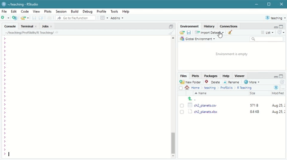

# Data {#data}

```{block, type = "los"}
You can skip this chapter if you:

  * Are comfortable working with dataframes and tibbles

  * Know about and are comfortable using some of R's inbuilt data packages

  * Are comfortable loading .csv and .xlsx files into R

```


## Packages for this chapter

In this chapter you'll want the following packages loaded in your R session. At the start, you will need to run the following code. Remember if you don't have a package you can install it with the `install.package("package_name")` command. 

```{r eval = FALSE}

library(tidyverse)
library(readxl)

```
```{r echo = FALSE, message=FALSE, warning=FALSE}

library(tidyverse)
library(readxl)

```


## Built In Data {#data_builtin}
Many packages, such as the `tidyverse` package, and the default ^['Default' here means one you won't need to install or load into the library] `datasets` package come with data in them. These datasets can be really useful for testing code that you're unfamiliar with, because you know what the data should look like, and how it should perform. 

Some common datasets are:

* `mpg`
    + Fuel economy data from 1999 to 2008 for 38 popular models of cars
  
*  `ChickWeight`
    + Weight versus age of chicks on different diets

* `starwars`
    + Name, height, weight, age, and other characteristics of Star Wars characters

* `iris`
    + The measurements (in cm) of the sepal length and width and petal length and width of 50 flowers in 3 species of iris
  
There are many, many more. You can explore some of them by typing `datasets::` into the console and instead of pressing 'enter', scroll the menu that pops up to help you autocomplete your command. 

```{block, type = "hey"}
You might wonder, what's the `::` in the `datasets::` command. The `::` is very useful and tells R to look inside the `datasets` package without having to actually load it into your library which can be very quick and easy.

But be careful! If you are sharing your code with lots of other people, this can sometimes make it a bit harder for other people to run your code. This is called 'environment management' and something you'll learn more about as your R journey continues. 
```


## Exercise {#ex_inbuiltdata}

For our first exercise we are going to look at some of the inbuilt datasets. 

What happens when you enter the following code^[If its not working - are you sure you have spelled it with a capital `View`?] into the console?

```{r eval = FALSE}

View(mpg)

```

You should see something like **Figure 3.1**

```{r echo = FALSE, fig.cap="The result of the 'View(mpg)' command", fig.align = 'center'}

knitr::include_graphics("images/03_data/rstud01.png")

```

The `View()` command is very handy for getting a quick window onto what data looks like. Unfortunately, the `View()` command only really works for **you** getting a look at your data. If you wanted to share your code, you would be better using a command which prints some of the data into the console.


So - what functions will tell R to print data into the console?

You can view the top of a dataset with `head()`

```{r warning = FALSE}

 head(mpg)

```

Note that this code has produced an output block. Unlike `View()` where I had to share a screengrab to show you what the output of the code was. This is why `head()` is a lot more reproducible than `View()` and should be your default for code sharing. See more about this in [workflows](#workflows).

Unsurprisingly we can also view the bottom of a dataset with ...

```{r warning = FALSE}

tail(mpg)

```


Another very useful way to look at a dataset is with the `summary()` function, which takes its best guess at how to summarise each variable in the dataset. 


```{r}

summary(mpg)

```

The `summary()` function highlights an important aspect of R - it knows the difference between numbers and characters. In the output block we can see that `manufacturer` is given the `Class` `character`. R knows it can't create a mean and a median from this data, so it simply tells you the `Length` of that data instead. What do you think the `r length(mpg$manufacturer)` refers to here? Answer in the footnote^[The Length of these variables is the number of rows in each one, which for this case is the same for each variable because this is a nice, tidy dataset].


## Data you create {#created_data}
Sometimes you will want to test something on pretend data, or run something on a very small dataset. In these cases, we can create a dataset in our environment. This can be really useful for [troubleshooting](#trouble) because you can create data that shows your problem, and this is easier to share with others.

For example, lets say we we were interested in this idea that R only sees `manufacturer` in `mpg` as a string of letters. How can we tell R that `manufacturer` is in fact a category? We can test on a smaller, simpler dataset. 


## Exercise - Creating data {#ex_createdata}

We are going to use a new function here called `tibble` which will make a dataframe quickly and easily. Before when we were typing things like `x <- 1`, we created a single thing in the environment. Now we want to create multiple thing (rows and columns) and that's what the `tibble` function will do. 

Try the following and watch what happens in your environment (you'll need the `tidyverse` loaded - see [above](#data))

```{r}

dat <- tibble(x = c(1, 2, 3, 4, 5, 6),
              y = c("A", "B", "A", "B", "A", "B"))

```

You can `View(dat)` to look at this (or use `head(dat)`). Let's try and replicate our weird `summary(mpg)` character issue. 

```{r message = FALSE, warning = FALSE}

summary(dat)

```

We **can** replicate the issue. You can see that the `y` variable has the `class: Character`. What can we do about it?

We essentially want to tell R that `y` is not a character, but a factor^[A factor is also called a categorical variable, or a grouping variable. If you're not sure you know what a factor is, [wiki](https://en.wikipedia.org/wiki/Categorical_variable) is a good place to review]. 

We can ask R more directly what `y` is by telling it exactly where to look. 

```{r message = FALSE, warning = FALSE}

is.character(dat$y)

```


The `$` symbol tells R that it needs to look inside `dat` for `y`. Try typing out `is.character(y)` or `is.character(dat::y)` and see what happens. What are those error messages telling you? ^[`is.character(y)` should give you an error message like `Error: object 'y' is not found` because `y` by itself does not exist in your environment. There's a way around this by 'attaching' data to your environment, which is a bit old fashioned and can result in problems down the line with your workflow (because you won't necessarily know if the person you're working with has also attached the data), so I recommend against it. `is.character(dat::y)` should give you an error like `Error in loadNamespace(name) : there is no package called 'dat'`. Unsurprisingly, this is telling you that the `::` sequence tells R to look inside a **package** for a thing called `y`, but that package doesn't exist. Packages and data frames are different things.]


If the `is.character()` function asks R if the named object is a character, how do you think we ask R if the named object is a factor? Try typing out your answer in the console to see what happens.

We therefore need to ask R to change the data. We can do this like so:

```{r message = FALSE, warning = FALSE}

as.factor(dat$y)

```


And we get a response. But what happens if we run `summary(dat)` again? 


```{r message = FALSE, warning = FALSE}

summary(dat)

```

Why do you think this happens? 


```{block, type = "hey"}

You should take time to stop and answer these questions before reading on - practice and thinking about R is the best way to learn.

```


It happens because we haven't actually changed the data. With `as.factor(dat$y)`, R told us the answer, but didn't edit the object in any way. To change the `dat` dataframe, we need to use the assign (`<-`) function to make sure R saves it into the environment. 

Here's the fun part. We can do this in two (or actually - many) different ways. In a lot of ways, its personal preference which one you choose . . .

To demonstrate, we will make two new dataframes. 


**Option 1**

```{r message = FALSE, warning = FALSE}

option1 <- tibble(x = dat$x, y = as.factor(dat$y))

```

**Option 2**

```{r message=FALSE, warning=FALSE}

option2 <- dat |> 
  mutate(y = as.factor(y))

```


```{block, type = "translate"}
In Option 1, we are essentially saying something like:

* Make a new thing called `option1`

* That thing is a tibble

* That tibble should contain x, from dat (`dat\$x`)

* That tibble should contain y, from dat, made into a factor (`as.factor(dat\$y)`)


Whereas in Option 2, we are saying:

* Make an new thing caled `option2`

* That thing should start the same as `dat`

* We use the **pipe** command  (` |> `) to say 'and then'

* So take `dat` **and then** change something in `dat` (the `mutate` function)

* Make y a factor (`y = as.factor(y)`)

```


With Option 2, we don't need to specify `dat$y` because we are using the pipe function (` |> `) to tell R we are still working with the `dat` dataframe.

The ` |> ` pipe is a relatively recent implementation, but `tidyverse` has utilised the `%>%` pipe from the `magrittr` package for years. Lots of documentation will use the magrittr pipe `%>%` online, and even in this book. Either is fine and should both work in any cases. ([There are a few special cases where they function differently which Hadley Wickham talks about here](https://www.tidyverse.org/blog/2023/04/base-vs-magrittr-pipe/))

Personally, I found the pipe function in `tidyverse` to be revolutionary when I learned it, and its by far my favourite way to write code. I find the code in Option 2 a lot easier to read than the code in Option 1, and we'll be using `tidyverse` in the rest of this book. However, here's another important thing:

```{block, type = "hey"}

You do not have to code like I do - so long as I can run your code, we don't have to approach a problem in the same way.

```

This will become clearer as we work through the book. 


To test that we have done what we wanted to do - let's run the `summary()` function again.


```{r message = FALSE, warning= FALSE}

summary(option1)

summary(option2)

```

And now we see that R has changed `y` into a factor, both ways, and now we have a different output to the `summary()` function. 


Thinking back to our `mpg` example - can you change the `mpg` dataset so that `manufacturer` is a factor? 


  * Can you change multiple variables to factors? 


  * Is `tidyverse` or base R easier to use for changing multiple factors?


  * If you google, do you find other ways of changing `mpg`?
  

Once you have tried these - you can view some of my answers [here](#ans_createdata)


## Loading data from your hard drive {#data_load}
Finally, sometimes you will have data delivered to you on a file that you will want to load in to R. These will usually be \*.csv or \*.xlsx files


These can easily be read in with a function. The most commonly used function for \*.csv files is `read.csv`. For excel files its `read_excel` from the `readxl` package. There are also ways to load data from URLs, and word documents, and all sorts!

The skill most needed to load files from your hard drive is the ability to navigate and understand folder structures (sometimes called **working directories**). If your desktop has a hundred files [then you should go and watch this video](https://youtu.be/bKjRKZxr-KY).


```{block, type = "hey"}
We will use two different files for the rest of this chapter.

You should download the two files and save them into the folder you are using for your R Project. We will explore directories a bit in the next section, but its better to start good practice now. 

The two files are:

  * ch2_planets.xlsx
  
  * ch2_planets.csv
  
  
You will find them on your Learn course under this week's materials. 

If you are learning independently, you will also find them in the [data folder](https://github.com/jillymackay/RatRDSVS/tree/master/data) on my github page. 
```


## Loading data{#ex_data_load}
### Loading from a CSV

There are two main ways to load a .csv file. 

The easy way is to navigate to the **environment** tab and click on **Import Dataset**

Scroll down to **From Text (base)** and click through the import wizard, navigating to where you saved your file. 

Here is a short demonstration:
```{r echo = FALSE, fig.cap="Using the Import Dataset wizard to load a csv file", fig.align = 'center'}



```

Note that the the import wizard runs code in the **console** which says something like:

```{r eval = FALSE, warning = FALSE, message = FALSE}

ch2_planets <- read.csv("~/data/ch2_planets.csv")

```

If you copy this code you can run it yourself. You know by now that anything to the left of the assign command (`<-`) is the name of the thing you're creating.

## Exercise {#ex_loadcsv}

Change this code so you're creating a dataset called `dat` not `ch2_planets`. [Answer here](#ans_loadcsv)


### Loading from an Excel file

Similar to above, you can upload an .xlsx file in two different ways, using the wizard, or by typing in the code. 

To use the wizard, you again navigate to the **environment** tab and click on **Import Dataset**

Scroll down to **From Excel** and click through the import wizard, navigating to where you saved your file. Depending on what your excel file looks like 

Here is a short demonstration:
```{r echo = FALSE, fig.cap="Using the Import Dataset wizard to load a xlsx file", fig.align = 'center'}

knitr::include_graphics("images/03_data/excel_open.gif")

```


This time, note that the **console** first loads a package (`library(readxl)`) before it loads the data. 


```{r eval = FALSE, warning = FALSE, message = FALSE}

library(readxl)
ch2_planets <- read_excel("ch2_planets.xlsx")


```

Again you can copy this code and run the code itself in an R Script file, in a R Markdown file, or in the console, to load the data without going through the wizard.


```{block, type = "hey"}

Why would you want to use code instead of the wizard?

We will come to talk about [repeatable workflows](#workflows) in a later chapter, but basically - if you send me an  R Script file with the code for loading in the data, I can run that file without having to edit it. 

You can send me your script and your data file together, and I can work directly on it, which saves a huge amount of time and makes collaborating easier. 

```

## Exercise {#ex_loadexcel}

This time I want you to load the ch2_planets.xlsx file into your environment. 

I assume that you have saved the ch2_planets.xlsx file to your working directory in a folder called `data`.

Your task: I don't want to have to load the `readxl` library every time I read in an excel file. Is there a short cut we can use?

Remember to try this - play about with the code and talk to your classmates/friends before looking at the answer. [Answer here](#ans_loadexcel)


