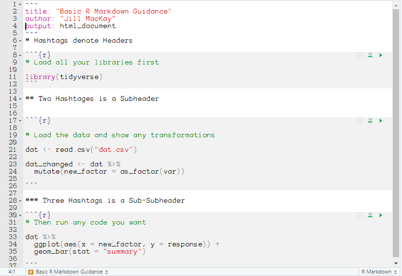
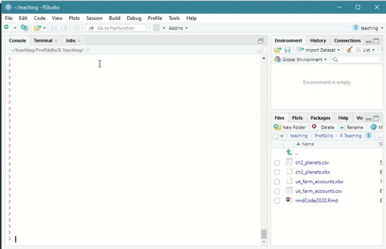

# Data Processing {#dataprocessing}


```{block, type = "los"}
You can skip this chapter if you:

  * Can download, open, edit and save an R Markdown file

  * Can describe the advantages of repeatable workflows

  * Can execute code in an R Markdown file

```


## Workflows {#workflows}
Throughout this book, I have been talking about the importance of repeatable workflows. 

If you're on a course that I'm teaching, I will share R Markdown documents with you that you can edit and I can view. We could both start with the same dataset, and by sharing our workflow, we can both know exactly what the other person has done. This data transparency is very important. Knowing what changes have been made to the data, and how those changes were made, can help prevent small mistakes being magnified. For example, a simple copy/paste error in excel, resulted in [an Edinburgh hospital being delivered over two years late](https://www.bbc.co.uk/news/uk-scotland-edinburgh-east-fife-53893101).

You  might think this can't apply to you, but think how many times you might make a change to a dataset in the process of cleaning that data and tidying it. If you had to describe what you did to a collaborator, would you remember every change?

One of the great advantages of using code to process data is that every stage can be documented. In this textbook I'm teaching you R, and on my courses I mainly use R Markdown files to document workflows, but R is just one statistical language and R Markdowns are just one file type. The process is the important part. 


### An example of sharing code

Imagine you have a big dataset like the UK Farm Accounts dataset:

```{r echo = FALSE, message = FALSE, warning = FALSE}
farm <- read_csv("data/uk_farm_accounts.csv", locale=locale(encoding="latin1"))
head(farm)
```


And let's say you want to explore the gross output of farming per year. You might decided it would be easier to change the name of the gross output variable to make coding easier. So you write the following in the console:

```{r message = FALSE, warning = FALSE}
farm <- farm |>  
  rename(gross_output = "Gross output at basic prices £ million")

```

And then you summarise gross output by year:

```{r message = FALSE, warning = FALSE}

farm  |>  
  group_by(Year) |> 
  summarise(mean_gross_output = mean(gross_output))

```

If you sent the above code chunk to me along with the original dataset, I would not be able to run it. I wouldn't know what variable you had renamed. So at the start of the R Markdown document you would would want to load in the data and run any transformations/changes. That way if you sent me the RMD and the data file, I would be able to replicate what you did exactly.

As a general practice, I aim to follow this structure in my RMD or R script files:

  1. Load any libraries that are needed
  2. Load the data
  3. Perform any data transformations
  4. Perform any analyses. 
  
There may be times when there's a good reason to do things in a different order, but you will rarely go wrong with this order (Figure 6.1)

```{r echo = FALSE, fig.cap="A general format of R Markdown files", fig.align = 'center'}



```


Sometimes in this book I have suggested using an R Script file instead of an R Markdown file. R Script files are good for short pieces of code, but if you want to talk about your code (say because you're trying to ask your lecturer a question) you might find the ability to type in full paragraphs useful, and that's where R Studio comes in. Some scientists will even write full papers in R Markdown, especially if there's a lot of analyses in them. You can find out more about [R Markdown formatting here](https://rstudio.com/wp-content/uploads/2015/02/rmarkdown-cheatsheet.pdf). 

## Opening R Markdown Docs {#openrmd}

R Markdown files work just like any other file in R Studio. You can open any R Markdown file by going to `File > Open File ...` and navigating to the folder your file is stored in. 

Your R Markdown file will 'look' for any linked files in the same folder its saved in, so if your data is saved in the same folder your R Markdown file is saved in, you can be quite lazy about your directories, e.g. `read.csv("data.csv")`. This can be very helpful in repeatable analyses. 


```{r echo = FALSE, fig.cap="Opening an R Markdown file in R Studio", fig.align = 'center'}



```


## Running Code {#codermd}
You can run code in R Markdown files by pressing the green 'triangle' button to run that specific piece of code.

```{r echo = FALSE, fig.cap="Running a code chunk in an R Markdown file in R Studio", fig.align = 'center'}

knitr::include_graphics("images/06_workflows/runcode.gif")

```

If you have your cursor clicked inside a code chunk you can also press 'ctrl + enter' on your keyboard to run that specific line. 

## Editing R Markdown Docs  {#editrmd}

You can edit both code and text chunks in R Markdown documents. 

A handy feature is the line numbers on the left-hand-side. You can tell your collaborator you're having trouble with Line 100, which can help them help you!