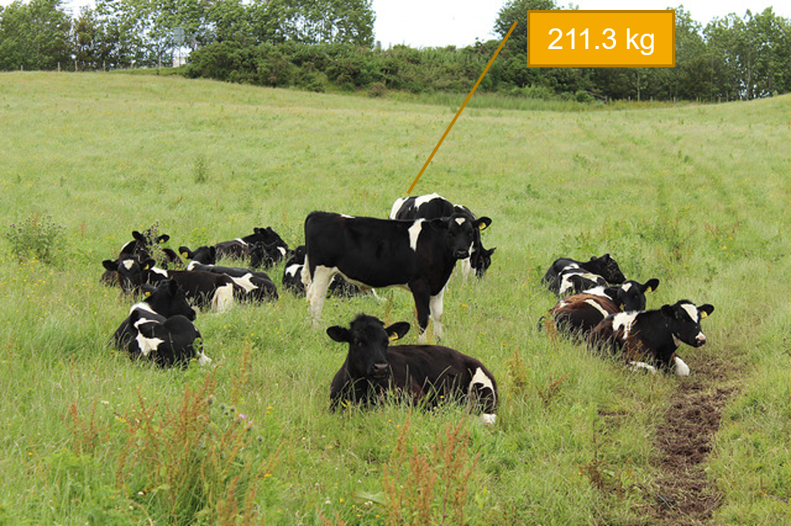
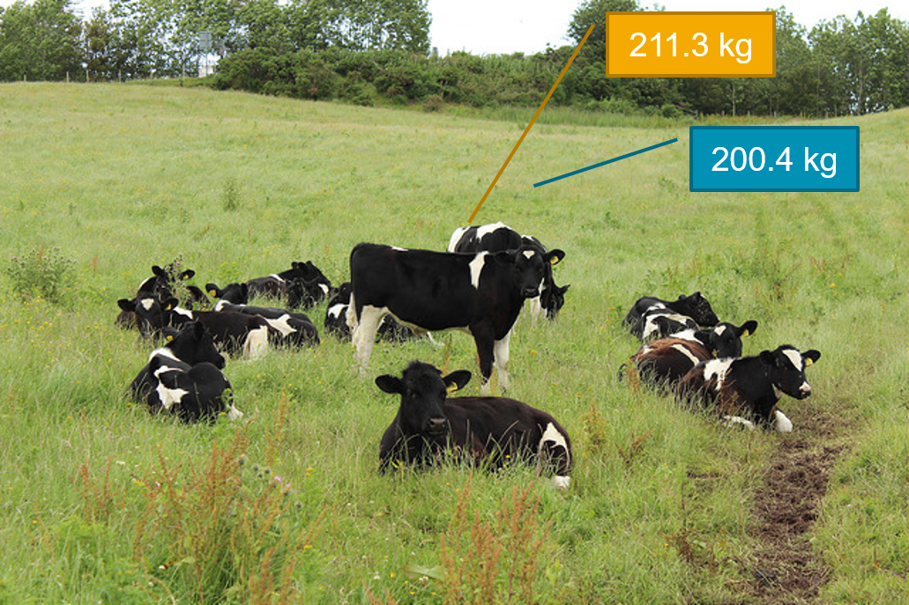

# Basic Statistics {#statsbasic}

```{block  type = "los"}

You can skip this chapter if ...

  * You can identify some common descriptive statistics
  
  * You can report descriptive statistics
  
  * You can describe the statistical formula for the mean and standard deviation


```

## Descriptive stats {#descstats}

Descriptive statistics, unsurprisingly, **describe** the data. But why do we need to describe data?

Imagine that we had a field of cows. 

```{r echo = FALSE, fig.cap="A field of heifers", fig.align = 'center'}

knitr::include_graphics("images/09_statbasic/cows_1.jpg")

```

We know that the first heifer has a weight of 211.3kg

```{r echo = FALSE, fig.cap="A field of heifers, 1 weight known", fig.align = 'center'}



```

And that the second heifer has a weight of 200.4kg

```{r echo = FALSE, fig.cap="A field of heifers, 2 weights known", fig.align = 'center'}



```

We can keep going, recording weights for every cow until we know all of them.

```{r echo = FALSE, fig.cap="A field of heifers, all weights known", fig.align = 'center'}

knitr::include_graphics("images/09_statbasic/cows_4.png")

```

They say that knowledge is power, and so now we know the weights of all these cows, we should be able to make better choices. Unfortunately, we often can't make choices on an individual basis, so we need to make a choice that suits the most cows. How can we condense this information down?

Statistics is really just condensing the real world down into simpler mathematical descriptions. 


### Mathematical notation
I've changed my mind several times about whether I should teach mathematical notation when talking about statistics. I've decided to include it in this chapter, but if you find yourself glazing over, don't worry too much. Sometimes I don't bother teaching this. 

I've made the decision to talk about it because fundamentally, understanding **what** is happening when you calculate a mean (or a standard deviation) can help you understand some of the more complicated parts of statistics. You will likely never be quizzed on this, so I wouldn't try to memorise them, but they can be a useful thing to know. 


#### General notation

Generally, in mathematical notation: 
 
 * Upper case letters denote a variable name ($X$, $Y$, $Z$ …)
 
 * Lower case letters denote a specific value of the variable ($x$, $y$, $z$ …)
 
 * Sample data is indicated with lower case letters ($v${$x_1$, $x_2$ … $x_n$})


So in this example we might say *Let heifer weight be $X$*.


### The mean {#stats_mean}

Let's create a dataset of heifer weight:

```{r warning = FALSE, message = FALSE}

coos <- tibble(heifer_id = c(1, 2, 3, 4, 5, 6, 7, 8, 9, 10, 11, 12),
               weight = c(211.3, 200.4, 220.1, 200.8, 222.0, 209.3, 
                          195.8, 220.4, 225.2, 218.7, 193.7, 209.7))

```


We always want to visualise our data first - but just knowing weight isn't that interesting:

```{r warning = FALSE, message = FALSE, fig.cap="Weight (kg) of 12 heifers",  fig.align = 'center'}

coos |> 
  ggplot(aes(x = heifer_id, y = weight, colour = as.factor(heifer_id))) +
  geom_point() +
  scale_y_continuous(limits = c(0, 250)) +
  scale_x_continuous(limits = c(0,12), breaks = seq(0,12,1)) +
  theme_classic() +
  theme(legend.position = "none") +
  labs(y = "Weight (kg)",
       x = "Heifer ID")

```

There's not much that we can say about this chart. Most heifers seem to weigh around 207kg. But that's an estimate that comes from me just eyeballing the data. We could draw a line at around 207kg, a line of best fit, which is a rough guess that tries to minimise the amount of distance between the line and each point. 


```{r warning = FALSE, message = FALSE, fig.cap="Weight (kg) of 12 heifers, with a human-estimated best fit line",  fig.align = 'center'}

coos |> 
  ggplot(aes(x = heifer_id, y = weight, colour = as.factor(heifer_id))) +
  geom_point() +
  scale_y_continuous(limits = c(0, 250)) +
  scale_x_continuous(limits = c(0,12), breaks = seq(0,12,1)) +
  theme_classic() +
  theme(legend.position = "none") +
  labs(y = "Weight (kg)",
       x = "Heifer ID") +
  geom_segment(x = 0, xend = 12, y = 207, yend = 207)

```

We could use maths to draw that line in a better place . . . 

If we add up all the values of weight and divide by the number of cows . . . 


```{r warning = FALSE, message = FALSE}

sum(coos$weight) / 12

```
We get the exact same value as if we asked R to calculate the mean directly (using the handy [`summarise` function](#tidy_summ)):

```{r warning = FALSE, message = FALSE}

coos |> 
  summarise(mean(weight))

```


#### Notation of the mean

We all know how to calculate the mean, but what does that look like in mathematical notation?

The equation for the mean is:

$$\overline{x} = \frac{\sum x^i}{n}    $$


```{block type = "translate"}

Let's break this equation down:

  * $\overline{x}$ is the mean of the sample
  
  * $\sum$, the greek letter **sigma** means 'add all this together'
  
  * $x^i$ means 'every data point in sample'
  
  * $n$ means 'number of observations in sample'.
```
```{r echo = FALSE, fig.cap="Formula for the mean", fig.align = 'center'}

knitr::include_graphics("images/09_statbasic/notation_mean.gif")

```

### The mean as a model

So now we know that $\overline{x}$ = 210.6kg. We have created an imaginary **model** cow. This model cow has a weight of 210.6kg, and we know that she is not exactly real, but we can choose to make use of her, because she has a little bit of information from all of the samples. 

```{r echo = FALSE, fig.cap="The mean cow", fig.align = 'center'}


```

## Median {#stats_median}

There are other imagniary cows we could build to represent our dataset. 

```{r warning = FALSE, message = FALSE, fig.cap="Weight (kg) distribution of 12 heifers",  fig.align = 'center'}

coos |> 
  ggplot(aes(y = weight)) +
  geom_boxplot() +
  theme_classic() +
  theme(legend.position = "none") +
  labs(y = "Weight (kg)")

```

The thick middle line in this boxplot represents the **median** cow. 

```{r echo = FALSE, fig.cap="The median cow", fig.align = 'center'}

knitr::include_graphics("images/09_statbasic/mediancow.png")

```


Now the formula for the median is a little more complicated than I want to get into here, but the median essentially puts all of the cows in order:

```{r warning  = FALSE, message = FALSE}

coos |> 
  arrange(weight)

```

And then we pick the middle value. We have 12 cows, so our two middle values are 209.7 and 211.3. So to find the median, we add those two values together and divide by 2. 

```{r, warning = FALSE, message = FALSE}

coos |> 
  summarise(median_weight = median(weight))

```


## Mode {#stats_mode}
The final simple model we will talk about is the **mode**, or the  most frequent value in a dataset. The mode isn't that useful, and so there isn't actually an inbuilt function to visualise or calculate it.


```{r message = FALSE, warning = FALSE}
mode <- function(v) {
   uniqv <- unique(v)
   uniqv[which.max(tabulate(match(v, uniqv)))]
}

coos |> 
  summarise(mode_weight= (mode(weight)))

```

The mode is a bit . . . useless . . . but it is still a model cow, so it also gets its own picture in this example. 

```{r echo = FALSE, fig.cap="The modal cow", fig.align = 'center'}

knitr::include_graphics("images/09_statbasic/modecow.png")

```


## Which model? {#stats_which}

The mean, mode and median cow all try to give a good approximation of **most** cows in our field. We know that they can't describe every cow in detail (because we don't want to have to learn every single cow's weight off by heart), but they all have to lose important information. 

With each of these models - we hope that our calculated weight is close to most of the population. We know that there is always natural variation in the world, and some cows might be very heavy, and some cows might be very thin, but our hope is that our models are fair representations of **most** cows in our dataset. But each model takes a different approach to this. 

The mean is also described as the central tendency, and it takes into account every single individual in the sample. However, if you have a very skinny or very heavy cow, they will (by virtue of how the mean is calcualted) have a big impact on the final value. 

The median takes the 'middle' value of the dataset, and can be very useful when you have extreme **outliers** in a dataset, because it essentially ignores those values. The median is sometimes referred to as the most resilient statistic because so long as at least 50% of your values are normal, the median will be close to at least 50% of your individuals. 

The mode, as the most common value in the dataset, but this is rarely very useful in biological data. What if we had two very small cows who weighed 100kg, and every other cow of normal weight had a unique value? The mode would make its imaginary cow 100kg, even though every other cow in the dataset was over 100kg heavier.  However, you can use the mode for nominal data, which can be useful, e.g. what is the most common name of cow?


## Measures of variation {#stats_variation}
In the previous section we talked about outliers, and how they can affect these three models of our cows. 

We've already [looked at ways to visualise distributions](#vis_hist), but lets remind ourselves:

```{r, warning = FALSE, message = FALSE, fig.cap="A histogram of heifer weight",  fig.align = 'center'}

coos |> 
  ggplot(aes(x = weight)) +
  geom_histogram(binwidth = 10) +
  theme_classic()

```

The histogram shows us how many cows are in each weight category (or 'bin'). We can overlay the mean, median and mode on this, to see which one gets closest to the 'middle'. 


```{r, warning = FALSE, message = FALSE, fig.cap="A histogram of heifer weight(kg), mean, median and mode shown",  fig.align = 'center'}

coos |> 
  ggplot(aes(x = weight)) +
  geom_histogram(binwidth = 10) +
  theme_classic() +
  geom_segment(x = 210.6, xend = 210.6, y = 0, yend = 4, colour = "pink2") +
  geom_segment(x = 210.5, xend = 210.5, y = 0, yend = 3.5, colour = "yellow1") +
  geom_segment(x = 211.3, xend = 211.3, y = 0, yend = 4, colour = "lightblue1")

```

Now these three lines (the median (yellow), mean (pink) and mode (blue)) are all very close to one another. So close in fact that the mean and median are nearly on top of one another. This suggests to us that our field of heifers is fairly **normal**. Most observations are around the mean, and so the mean and the median are fairly similar. We have very few unusual observations (very few underweight or overweight cows). 

Again, this is just us eyeballing the data. It can be useful to put numbers on how variable a dataset is. 

### Variance {#stats_variance}

Variance ($\sigma^2$) describes how far away each observation in our sample is from the sample mean. 

If we drew a line representing the mean ($\overline{x}$) on our scatteplot of each individual value, we could measure how far away each point was from the line. If we added all these numbers together they would sum to zero (if you want to see a proof of this [jump here](#stats_proofvariance)). 


```{r warning = FALSE, message = FALSE, fig.cap="Weight (kg) of 12 heifers, with a mean line",  fig.align = 'center'}

coos |> 
  ggplot(aes(x = heifer_id, y = weight, colour = as.factor(heifer_id))) +
  geom_point() +
  scale_y_continuous(limits = c(0, 250)) +
  scale_x_continuous(limits = c(0,12), breaks = seq(0,12,1)) +
  theme_classic() +
  theme(legend.position = "none") +
  labs(y = "Weight (kg)",
       x = "Heifer ID") +
  geom_segment(x = 0, xend = 12, y = 210.6, yend = 210.6, colour = "pink2")

```

So we need to transform the distances by squaring them. Now, if we were dealing with hundreds of observations we would of course have a much bigger number, so we need to standardise them by the number of observations (just like we do with the mean calculation). 

We can calculate the variance of the cows' weight very easily:


```{r, warning = FALSE, message = FALSE}

coos |> 
  summarise(variance = var(weight))

```

#### Formula for variance

Variance is calculated like this:

$$\sigma^2 = \frac{\sum(x-\overline{x})^2}{n-1} $$

```{block type = "translate"}

Breaking this equation down ...

  * $\sigma^2$ is the symbol for variance
  
  * $\sum(x-\overline{x})^2$ means 'take each value of $x$ and subtract the mean ($\overline{x$}). Square this value ($^2$) and add them all together ($\sum$)
  
  * Divide this value by the total number in the sample, minus 1 ($n-1$). We say $n-1$ because we are estimating the variance of a sample population^[Why is n-1 you may ask? The short answer is that this is called the [Bessel's Correction](https://en.wikipedia.org/wiki/Bessel%27s_correction) and I'm happy to talk about it with you, but this chapter's long enough as it is.]

```


### Standard Deviation {#stats_sd}

The standard deviation ($\sigma$) is very similar to variance ($\sigma^2$). Can you guess what the difference is?

The standard deviation is the square root of the variance. When we calculate the variance, we simply sum all the squares together, but we really want to express this number in the same unit as the original measurements (not the square of the measurements). So if we take the square root of the variance, we calculated the standard deviation. This makes the standard deviation a really useful add-on to the mean, because its expressed in the same units. 

We can of course calculate this:


```{r, message = FALSE, warning = FALSE}

coos |> 
  summarise(standard_deviation = sd(weight))

```


#### Formula for standard deviation. 


$$\sigma = \sqrt \frac{\sum(x-\overline{x})^2}{n-1} $$

```{block type = "translate"}

Breaking this equation down ...

  * $\sigma$ is the symbol for standard deviation
  
  * $\sum(x-\overline{x})^2$ means 'take each value of $x$ and subtract the mean ($\overline{x}$). Square this value ($^2$) and add them all together ($\sum$)
  
  * Divide this value by the total number in the sample, minus 1 ($n-1$)
  
  * Take the square root ($\sqrt$) of this value.
```


### Standard Error {#stats_se}

The third and final measure of variance I'll discuss in this chapter is the **standard error** ($\sigma_\overline{x}$). 

The standard error is an attempt to describe how far away the sample mean ($\overline{x}$) is from the true population mean ($\mu$)? 

In our cows example, we've measured 12 cows, but we know this is not all the cows in the world. If, in theory, we could measure every single cow in the world, we could calculate the variance of the population (we wouldn't need to say $(n-1)$ in our variance calculation because we would know exactly how many cows we had).

$$\sigma_{population} = \sqrt \frac{\sum(x-\overline{x})^2}{n_{population}} $$

In this case $n_{population}$ is every single cow in the world. So if we know how many cows are in our sample, we could calculate the variance of our sample ($\sigma^2_{sample}$) in a slightly different way:

:

$$\sigma^2_{sample} = \frac{\sigma^2_{population}}{n_{sample}}$$

Now we hardly ever calculate our sample variance this way because we are rarely ever in a position where we know every single value. 

Remember that above we saw that the standard deviation ($\sigma$) was the square root of the variance ($\sigma^2$). The standard error is the standard deviation divided by the square root of the sample size. This is a bit complicated - and harks back to old algebra lessons about moving variables from one side of an equation to another, and you [can read more about it on wiki](https://en.wikipedia.org/wiki/Standard_error).

All you need to know is this:

```{block, type = "hey"}

The standard error of the mean is the standard deviation of its sampling distribution. 

The standard error of the mean is an estimate of how good the mean is at describing the whole population. 

It will always be smaller than the standard deviation. 

```


#### Formula for the standard error of the mean

The standard error of the mean is calculated like this:

$$\sigma_{\overline{x}} = \frac{\sigma}{\sqrt{n}} $$


```{block type = "translate"}

Breaking this equation down ...

  * $\sigma_{\overline{x}}$ is the symbol for the standard error of the mean
  
  * $\sigma$ is the standard deviation of the sample
  
  * Divide this value by the square root of the total number in the sample ($\sqrt{n}$)
  

```


And like always, we can calculate this, although there's no inbuilt function to do this, we know the equation is pretty simple:

```{r message = FALSE, warning = FALSE}

coos |> 
  summarise (standard_error_mean = sd(weight)/sqrt(length(weight)))

```


## Calculating descriptive stats

So with our cows, we can calculate lots of different values that each say something a little bit different about our dataset. On their own, these numbers are not always useful, but its important to recognise the relationship between a lot of these calculations. 


Lets calculate all of these things in one table:


```{r message = FALSE, warning = FALSE}

coos |> 
  summarise(median_weight = median(weight),
            mode_weight = mode(weight),
            mean_weight = mean(weight),
            variance_weight = var(weight),
            sd_weight = sd(weight),
            sem_weight = sd(weight)/sqrt(length(weight)))

```

## Reporting on heifer weight

If we wanted to report on heifer weight, we would want to give our best description of the data, which is usually the  mean and standard deviation of a normally distributed dataset. And it's always a good idea to point your reader towards a visualisation of the data. 

To report any statistic, you first describe the result in plain English, and then, in brackets, add the proof (which is usually the statistical result and/or a figure.) 

The type of model you choose is entirely up to you. There's no 'perfect' answer, just the one that best represents your data. 

> Heifers in this field weighed on average 210.6kg +/- 10.88kg (median = 210.5kg, Figure 9.15)

```{r warning = FALSE, message = FALSE, fig.cap="Weight (kg) distribution of 12 heifers, mean = 210.6kg +/- 10.88kg",  fig.align = 'center'}

coos |> 
  ggplot(aes(y = weight)) +
  geom_boxplot() +
  theme_classic() +
  theme(legend.position = "none") +
  labs(y = "Weight (kg)")

```
