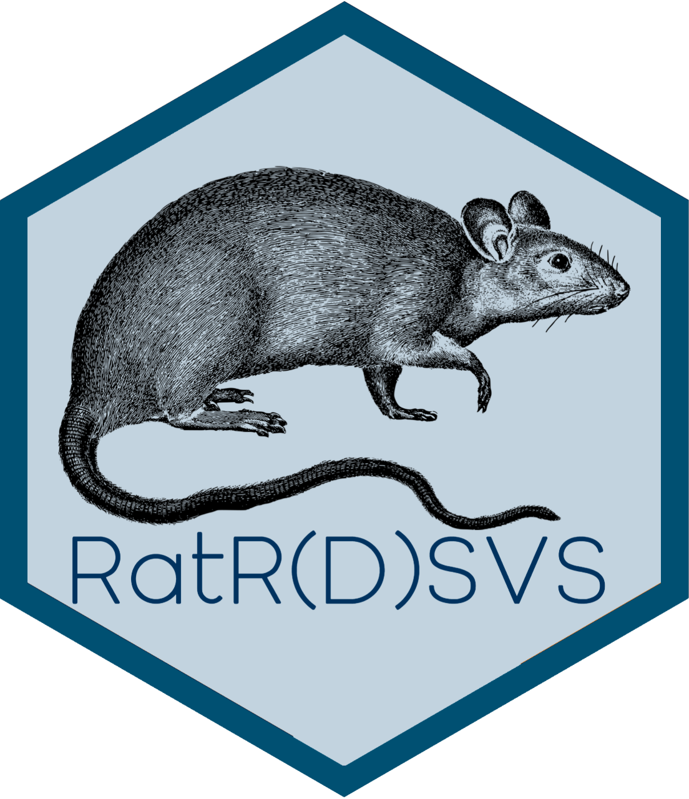

# R @ R(D)SVS {-}
This book will help you get started in R. It's designed for students (and staff) at R(D)SVS, and is free to use and adapt.


```{r echo = FALSE, out.width="50%", fig.align = 'center', message=FALSE, warning = FALSE}

library(tidyverse)
library(knitr)
```


<!-- If you need PDF output, uncomment bookdown::pdf_book above in YAML. You will need a LaTeX installation, e.g., https://yihui.name/tinytex/ -->


```{block2 type = "puzzle"}


If ever I get the CSS working this text will look different


```